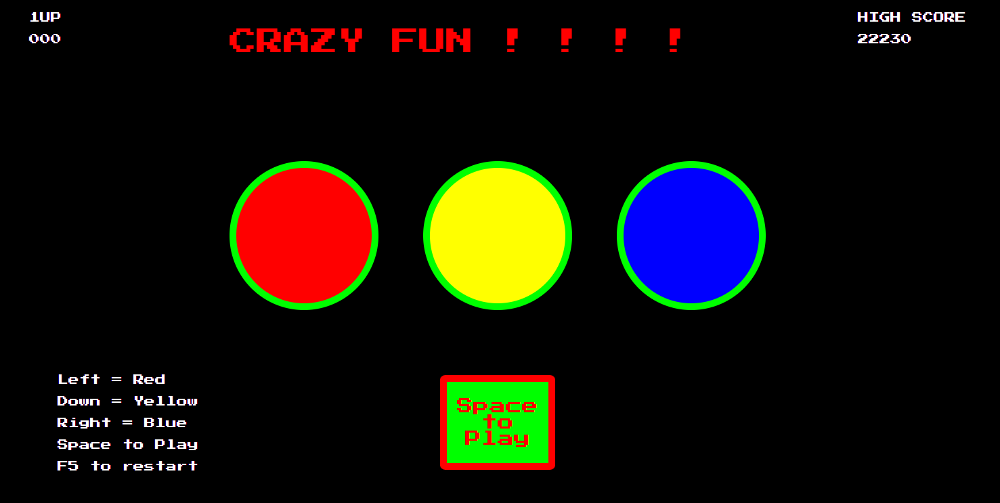
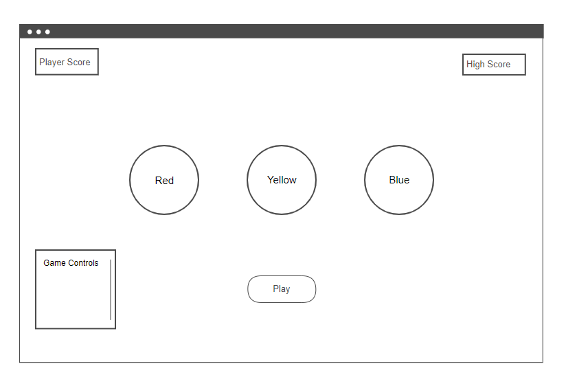
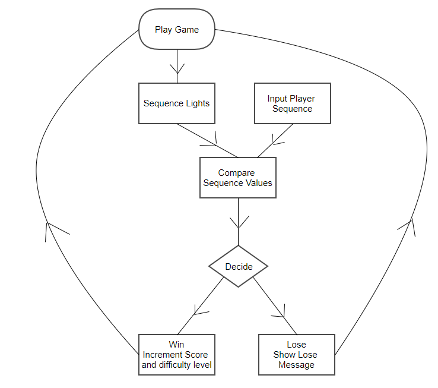
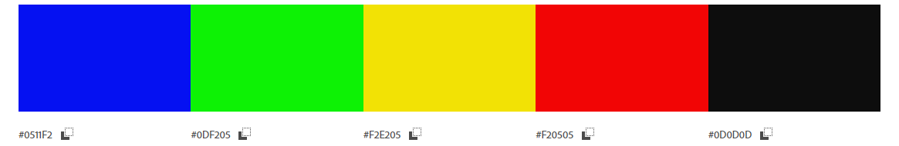
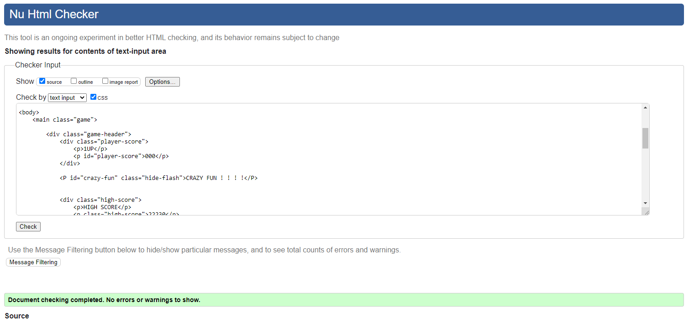

Memory Game

A small arcade style game written in JavaScript, HTML, and CSS. The game randomly sequences 3 colored lights on the screen.  The player has to try and remember the sequence and play it back.

The score increases if the player gets it right.
When the player wins the level of difficulty increases by making the sequence longer.

The game is very easy in the beginning but rapidly becomes more difficult as the player wins.

 **March 28, 2023**

 Game controls
 The game is designed "Arcade Style", for the desktop with keyboard controls.  The mouse does not interact with the game.
 The game does not play a mobile device.

 The game controls consist of a single button to start the game using the space bar.

 Left Arrow activates the red light.
 Down arrow activates the yellow light.
 Right Arrow activates the blue light.
 F5 restarts the game.

 ## Game Wireframe
 

 ## Game Flow Chart
 

## Color Scheme

## Typography

I used Google Fonts Press Start 2P to create the 80s Arcade style font. This font is perfect for what I am doing.

## Code Validation

## Audio
For the audio I used Howler.JS
https://github.com/goldfire/howler.js#documentation

howler.js is an audio library for the modern web. It defaults to Web Audio API and falls back to HTML5 Audio. This makes working with audio in JavaScript easy and reliable across all platforms.

Additional information, live demos and a user showcase are available at howlerjs.com.

Follow on Twitter for howler.js and development-related discussion: @GoldFireStudios.

## Bugs
There is an annoying problem with the player selection audio levels which occurs after one cycle of the game.
I am unsure why this occurs as I have the volume level hard-coded in the howler.js function call.
I have not been able to find information yet to solve this problem.